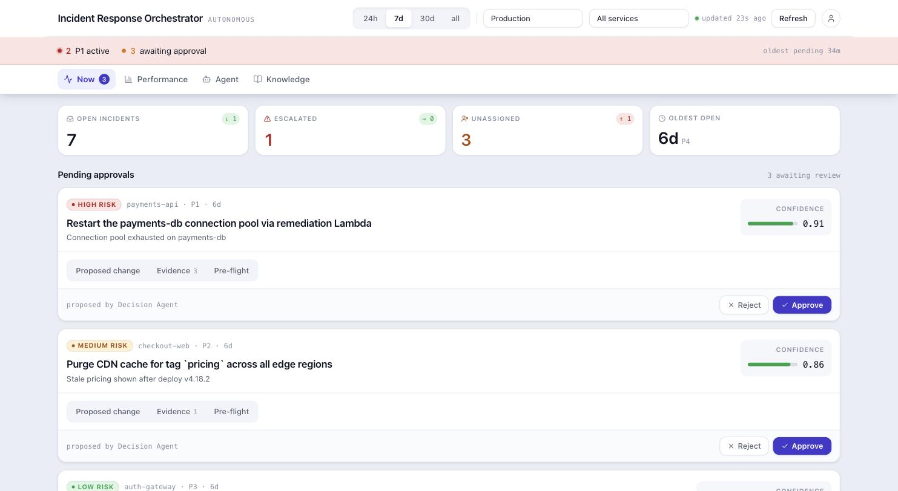
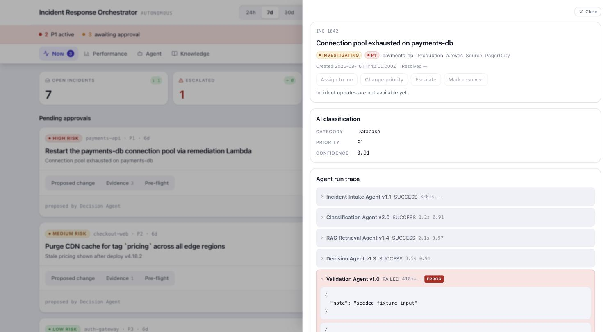
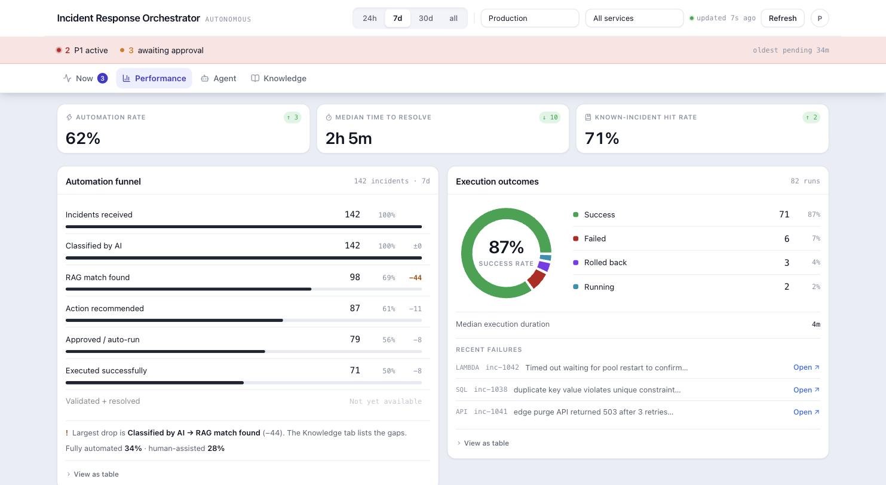
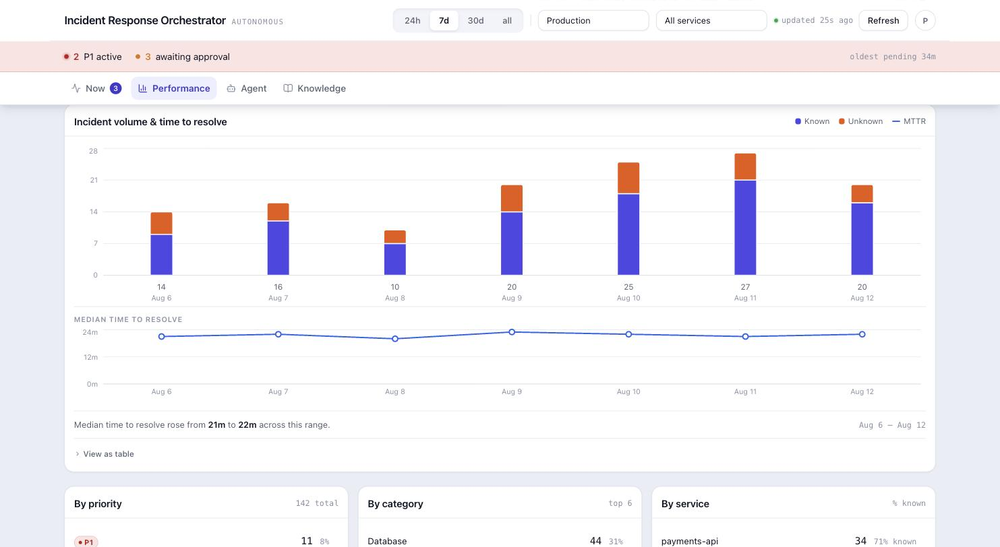
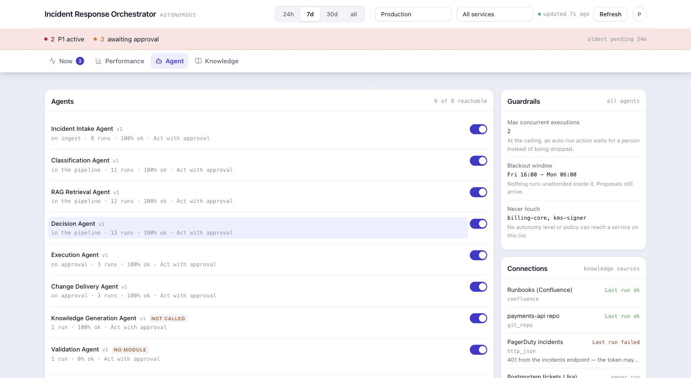
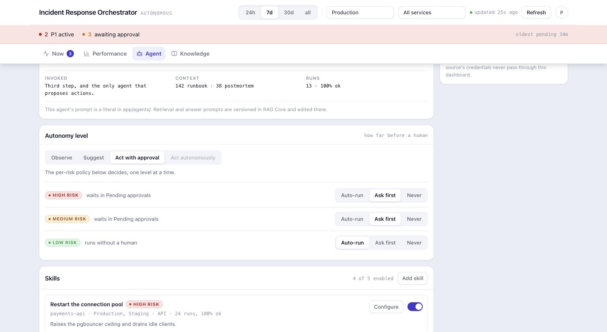
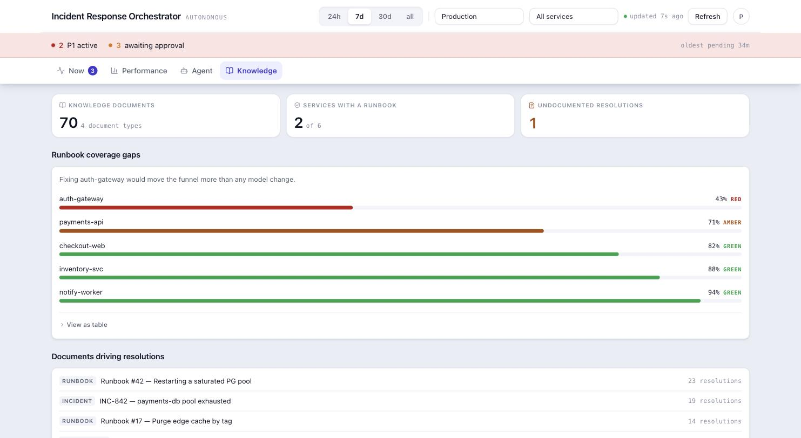

# Incident Tracker UI

Frontend for the **AI Incident Response Orchestrator** — a hackathon MVP for Cox Automotive's
ReconMVS team. It gives an on-call engineer one place to see incidents an agent has triaged, read
the evidence behind each recommendation, approve or reject what it proposes, and decide how far the
agents are allowed to go on their own.

The organising idea, and the thing worth judging the UI against: **agents propose, a person
decides, and everything is traceable.** Nothing on screen is asserted that the system cannot show
you the basis for — where a number came from, which rule produced an outcome, and what would
happen if you pressed the button.

---

## The four tabs

A persistent **alert strip** sits above all of them — active P1s and actions awaiting approval,
polling on its own 30-second cadence regardless of which tab is open, because "something needs you"
must not be behind a tab.

### Now — what is happening



KPI tiles, the approval queue, and the incident table. Each approval card carries three panels:
**Proposed change** (the diff the agent wrote, parsed and rendered), **Evidence** (the runbooks and
postmortems retrieval actually matched, with scores), and **Pre-flight** — what would happen if you
approved it.

Pre-flight is worth calling out. It runs the same guards the executor runs — is there an executor
registered for this action type at all, does the target clear the allowlist, would delivery push for
real or stop at a dry run — and answers *before* the decision instead of after it. On the seeded
data it immediately says something useful: the P1, HIGH-risk, confidence-0.91 pool restart is a
`LAMBDA` action, and nothing in the registry can carry it out.

Clicking any row opens the detail drawer:



The agent run trace is real provenance — model, latency, confidence and the actual input/output
JSON per agent, including the ones that failed. The `Validation Agent v1.0 FAILED` row above is not
a mock: that agent is registered with no module behind it, and the UI says so rather than hiding it.

### Performance — where the bottleneck is



The funnel's bar length is each stage's **share of incidents received**, so the shape narrows the
way the funnel actually does. The stage-to-stage conversion rate is the number beside the count —
it is useful, but it cannot be a length: a stage that loses nothing would draw wider than the stage
above it. Under the chart, the conclusion in prose, because a reader taking one thing from this card
should take which loss to go fix.

The outcome donut keeps `ROLLED_BACK` as its own bucket — never folded into success or failure — and
its legend is the numbers rather than a second list to join by eye.



Volume and MTTR are one card with two plots and **one scale each**. They were a single plot with two
y-axes, which invents a relationship that is not in the data — with one bucket near 1600 minutes the
median line collapsed onto the floor and said nothing about any other day.

### Agent — the orchestrator, and what each agent may do



The roster the rest of the dashboard never showed. Per-agent run counts and success rates are real,
and each row says **what invokes it** — including when the answer is nothing. Two of the eight are
labelled honestly: `NOT CALLED` for the agent that is implemented and reached by no route or
pipeline step, and `NO MODULE` for the one seeded into the registry with no Python class behind it.
Eight registered agents were never eight running agents.

The switch is not cosmetic — the registry selects `WHERE name = $1 AND is_active`, so switching an
agent off stops it running.



**Autonomy** and the **per-risk policy** are where `approval_required` is decided. It used to be the
literal `TRUE` in an INSERT — the model was asked for a risk level, the value was stored, and
nothing read it, so no proposal could ever run unattended at any risk level. Now `Auto-run |
Ask first | Never` is an operator's decision that the backend enforces on the next incident.

`Act autonomously` renders disabled with its reason until the server is deliberately started with
it enabled: that level removes the human from the loop, and it should not be reachable by anyone who
can merely reach the dashboard.

**Skills** is the catalogue the policy consults. Its action-type field is where the system tells you
what it cannot do: `SQL`, `LAMBDA` and `KUBERNETES` are in the planner's vocabulary with nothing
registered to execute them, so the option reads `SQL — no executor` and choosing one raises a
sentence before the skill exists.

The right rail holds what bounds every agent — the concurrency ceiling, the change blackout window,
the never-touch service list — and the knowledge sources, read-only. A source's credentials are held
by RAG Core behind its own key and never pass through this dashboard.

### Knowledge — what the corpus is missing



Coverage gaps by service, ordered worst-first, with the sentence that names the one fix worth making.
Below it, which documents are actually resolving incidents — the corpus judged by use rather than by
size.

---

## Design notes

- **Colour is measured, not chosen.** Every categorical palette here passes a colour-vision
  and contrast check. `ROLLED_BACK` violet and `RUNNING` cyan exist as separate tokens because the
  obvious choices sat at ΔE 0.4 under deuteranopia — the same colour. Red and green cannot be
  separated by hue at all, so `--bad` is the darker red-700, which is the only channel that pair has
  left.
- **Colour is never the only signal.** Every priority, risk, status and outcome carries a text
  label, and every pre-flight check carries an icon and a word.
- **Magnitude is drawn in ink.** A page where every bar is the same saturated brand hue spends its
  loudest channel on nothing, which is what stops the bars that *do* mean something from meaning it.
- **Four states per panel** — loading, empty-no-data, empty-filtered, error — and a failing panel
  never takes down its neighbours.
- Light theme only, targeting a ~1360px desktop. Charts do not animate: these panels poll, and a
  chart that replays its entrance on every refetch is a chart redrawing itself for no reason.

## Running it

Requires Node 20. A project-local `.npmrc` points installs at the public npm registry regardless of
any global config.

```bash
npm install
npm run dev        # http://localhost:5173
```

`npm run dev` needs no backend. Every request is intercepted in the browser by **MSW** against a
seeded fixture dataset, so the whole app — including creating a skill and stepping through an
approval — is interactive with zero setup. The fixtures deliberately include the uncomfortable
cases: an agent with no module, a source whose last poll failed, an action type nothing can execute.

Against the real stack, the dashboard is served by nginx which proxies `/api` to the orchestrator
(`CR-INC-Backend`), which is the only service that talks to RAG Core. See that repo's README for
`docker compose up`.

```bash
npm run build       # typecheck + production build
npm run test        # 383 unit/component tests (Vitest)
npm run test:e2e    # Playwright — run `npx playwright install` first
npm run typecheck
npm run lint
```

## Project layout

```
src/
  components/   UI by area: layout, kpi, incidents, approvals, charts, agent, shared
  domain/       Pure logic (age thresholds, funnel maths, deltas) — clock-injected,
                no framework or fetch dependency
  api/          Typed client + one module per endpoint, plus fixtures/ (seeded dataset
                and the MSW handlers used by both the dev server and the tests)
  state/        URL query-string state (filters, active tab, open incident), operator
                identity, focus trap
```

## Where the real detail lives

Driven by [Spec Kit](https://github.com/github/spec-kit): the product spec, architecture plan, data
model and task breakdown live under `specs/001-incident-response-dashboard/`, governed by the 14
binding principles in `.specify/memory/constitution.md`. Start at `CLAUDE.md` for a map — including
the requirements most easily broken by an obvious-looking change (the alert strip never stops
polling, median not average, `ROLLED_BACK` is its own bucket, approve is idempotent, resolving one
approval must not disturb a sibling).
