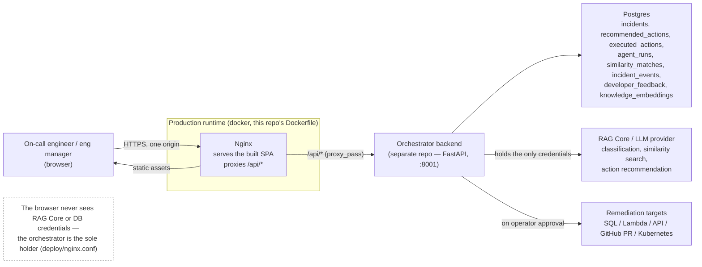
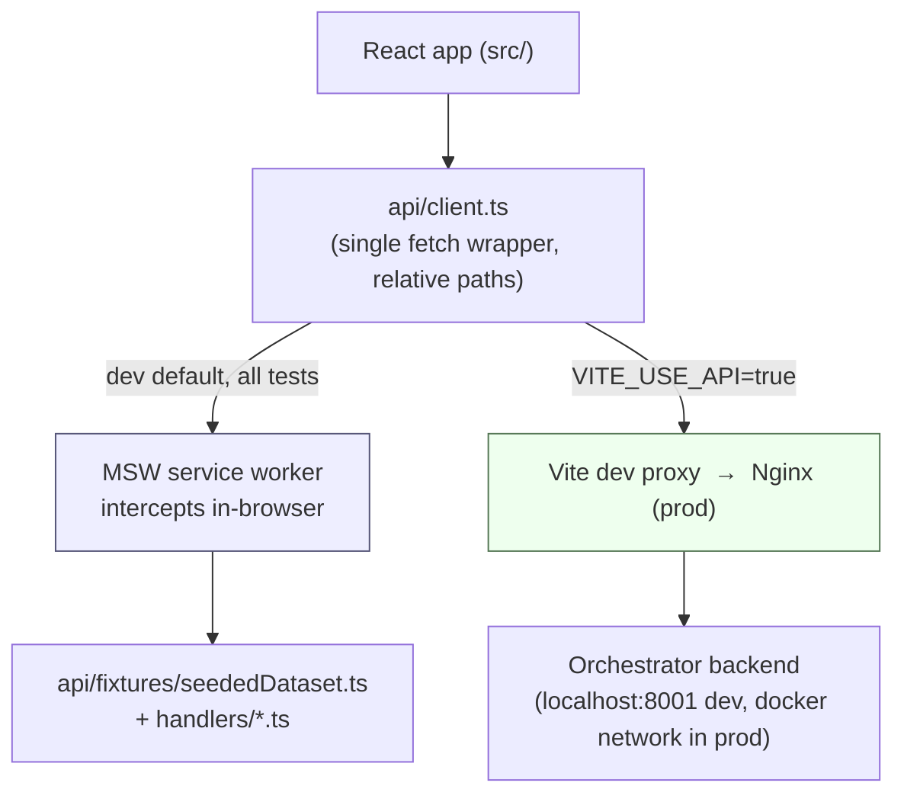
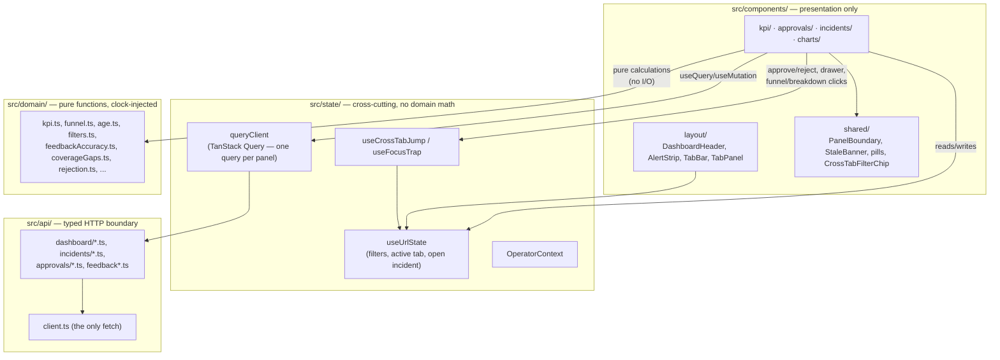
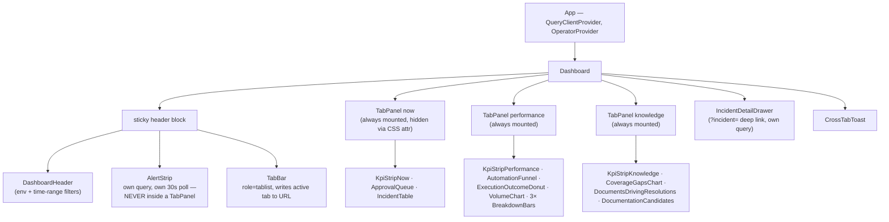
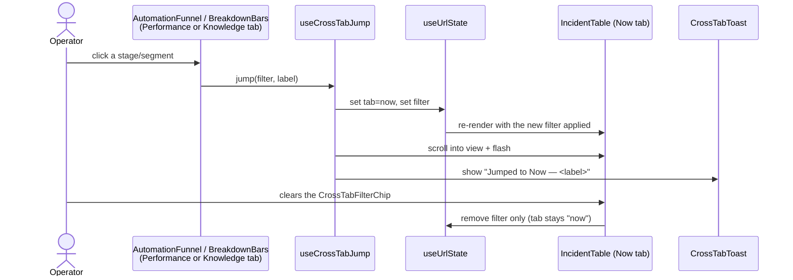
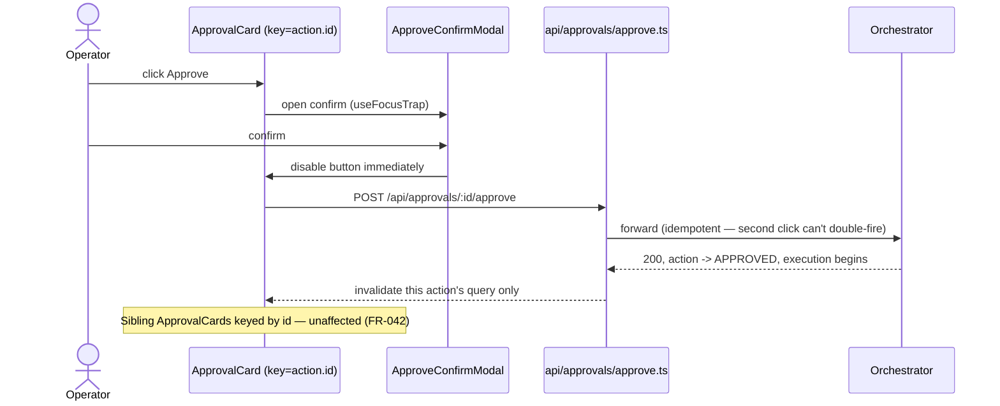

# Architecture

High-level diagrams for the AI Incident Response Orchestrator dashboard. This repo is the
**frontend only** — see `specs/001-incident-response-dashboard/plan.md` for the authoritative
technical plan and `.specify/memory/constitution.md` for the binding rules these diagrams
illustrate. Detail on individual components lives in `component-inventory.md`; API shapes in
`contracts/*.md`.

## 1. System context

The SPA never talks to the database, an LLM, or any remediation target directly — only to the
orchestrator, through same-origin `/api`.

## 2. Two ways to run the frontend

The same built artifact runs against either boundary — nothing in application code branches on
which one is active (constitution, Technology Constraints: `api/client.ts` is the only `fetch`).

- **Fixture mode** (default `npm run dev`, and always in Vitest/Playwright): MSW answers every
  request from the seeded dataset — zero backend setup, deterministic tests.
- **Live mode** (`VITE_USE_API=true npm run dev`, and always in the production image): MSW never
  starts; the Vite proxy (dev) or Nginx `location /api/` (prod) forwards to the real orchestrator.

## 3. Frontend internal layering

Enforced by the constitution: `domain/` has no React or fetch dependency and is unit-testable with
an injected clock; `components/` never computes metrics inline; all server state lives in
TanStack Query, all shareable view state in the URL.

## 4. Runtime composition (why the strip and tabs behave the way they do)

Because all three `TabPanel`s stay mounted and the alert strip lives outside every panel, switching
tabs is a pure visibility toggle — no refetch, no skeleton, and Performance/Knowledge keep polling
in the background exactly as if they were visible (FR-019, research.md §11).

## 5. Key cross-cutting flows

**Cross-tab jump** — a funnel stage or breakdown segment click is a navigation, not a filter:

**Approve action (idempotent, sibling-safe)**:

## Related documents

| Question | Where to look |
|---|---|
| Why these libraries (TanStack Query, hand-rolled tabs, MSW, `sql-formatter`)? | `specs/001-incident-response-dashboard/research.md` |
| Full field-level entity shapes | `specs/001-incident-response-dashboard/data-model.md` |
| Every component, its classification, and its owning FRs | `specs/001-incident-response-dashboard/component-inventory.md` |
| Request/response shape per endpoint | `specs/001-incident-response-dashboard/contracts/*.md` |
| Binding architectural rules (not just decisions) | `.specify/memory/constitution.md` |
